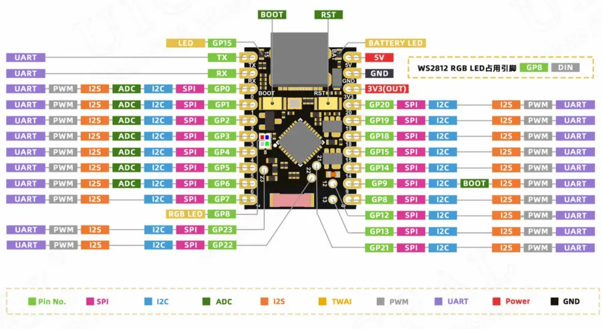

# F411-board

## Board

## Scheme

[Open Scheme (PDF)](Files/Scheme.pdf)

## Modules

### STM32F411CEU6:

| Module   | Pins                                           |
|:---------|:-----------------------------------------------|
| ESP32    | UART2(pa2,3)                                   |
| Flash    | SPI1(pa5,6,7) + CS(pa4)                        |
| SD       | SPI1(pa5,6,7) + CS(pb9)                        |
| TFT      | SPI1(pa5,6,7) + CS(pb10) + DC(pb12)            |
| Encoder  | CLK(pa1) + DT(pa15) + SW(pa0)                  |
| Joystick | Ox(pb0) + Oy(pb1) + SW(pb8)                    |
| MPU6050  | I2C1(pb6,7) + int(pb3)                         |
| Ext pins | UART1(pa9,10) + SPI2(pb13,14,15) + I2C1(pb6,7) |
| Other    | Led(pc13) + Key(pa0) + Buz(pa8) + DHT22(pb5)   |

### ESP32-C6 SuperMini:

| Module   | Pins                                    |
|:---------|:----------------------------------------|
| STM32    | UART0(TX,RX)                            |
| OLED     | I2C(14,15)                              |
| NRF24L01 | SPI2(1,6,7) + CE(18) + CS(19) + IRQ(20) |
| IR       | RX(0) + TX(2)                           |
| Encoder  | CLK(5) + DT(3) + SW(4)                  |

## STM32F411CEU6 Pinout

## ESP32-C6 SuperMini Pinout

