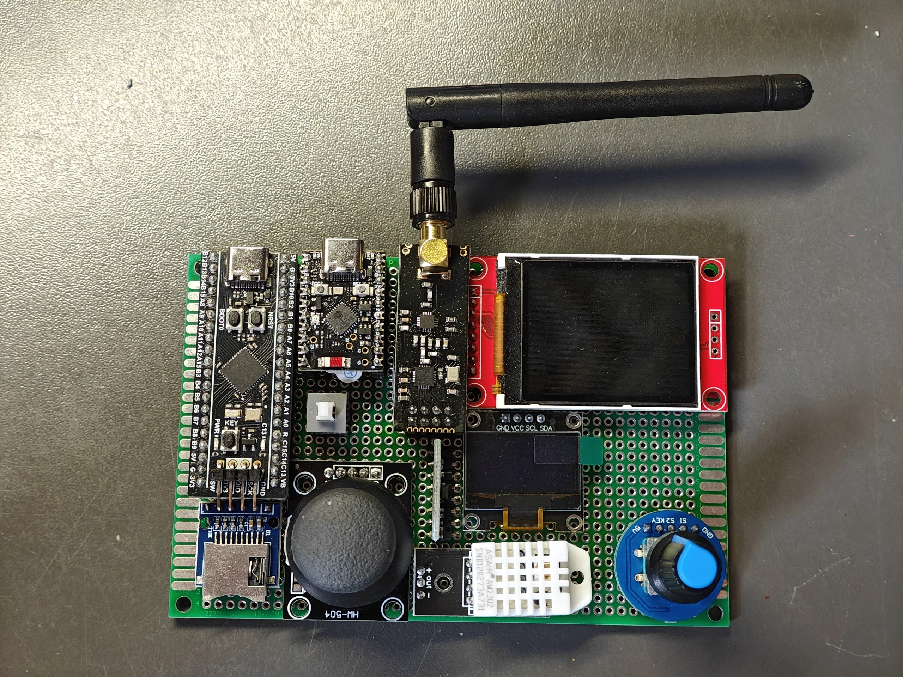
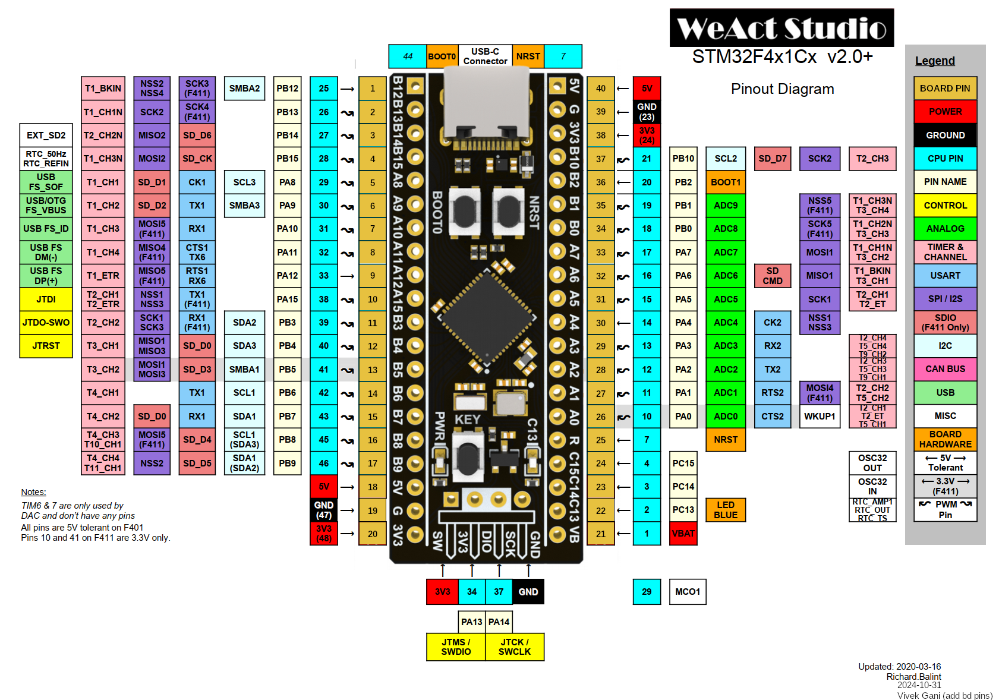

# F411-board

## Board

## Modules

### STM32F411CEU6:

| Module   | Pins                                           |
|:---------|:-----------------------------------------------|
| ESP32    | UART2(pa2,3)                                   |
| Flash    | SPI1(pa5,6,7) + CS(pa4)                        |
| SD       | SPI1(pa5,6,7) + CS(pb9)                        |
| TFT      | SPI1(pa5,6,7) + CS(pb10) + DC(pb12)            |
| Encoder  | CLK(pa1) + DT(pb4) + SW(pa0)                   |
| Joystick | Ox(pb0) + Oy(pb1) + SW(pb8)                    |
| MPU      | I2C1(pb6,7) + int(pa15)                        |
| Ext pins | UART1(pa9,10) + SPI2(pb13,14,15) + I2C1(pb6,7) |
| Other    | Led(pc13) + Key(pa0) + Buz(pa8) + DHT22(pb5)   |

### ESP32-C6 SuperMini:

| Module   | Pins                                           |
|:---------|:-----------------------------------------------|
| STM32    | UARTx()                                        |
| OLED     | I2Cx()                                         |
| NRF24L01 | SPIx() + CE() + ?CS()                          |
| IR       | RX() + TX()                                    |
| Encoder  | CLK() + DT() + SW()                            |

## STM32F411CEU6 Pinout

